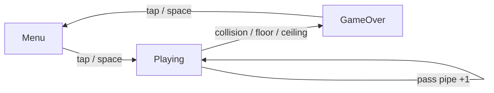

<div align="center">

# Flappy Bird

**A one-button side-scroller in Godot 4 — flap through an endless pipe field, one tap at a time.**

Faithful clone of the original: brutal one-pipe-at-a-time difficulty, modern juice
(screen shake, flap animation, parallax), local high-score persistence, and a
WebAssembly build playable directly in the browser.

[](https://0xrnato.github.io/flappy-bird/)
[](https://godotengine.org/)
[](https://docs.godotengine.org/en/stable/tutorials/scripting/gdscript/)
[](https://github.com/0xRnato/flappy-bird/actions/workflows/export-web.yml)
[](LICENSE)

[**▶ Play now**](https://0xrnato.github.io/flappy-bird/) · [Architecture](#architecture) · [Quickstart](#quickstart) · [Stack](#stack) · [Features](#features)

</div>

---

## Why

Flappy Bird is the smallest surface area a real 2D game needs to cover: one
input, one obstacle, no AI, no levels, no save slots beyond a single integer.
Every subsystem a Godot project eventually touches — physics, collision shapes,
scene composition, signals, autoloads, persistence, audio, UI state machine,
web export — has to be exercised, but none of them can sprawl. The scope is
locked by the genre itself.

What this clone adds on top of the original:

- **Deterministic physics** via `CharacterBody2D` (no rigid-body floatiness).
- **Modern juice** — flap animation, screen shake, hitstop, parallax scroll.
- **Zero-cost hosting** — HTML5 + GitHub Pages, no backend, no accounts.
- **Local-only persistence** — `ConfigFile` at `user://score.cfg`, one integer.
- **Web-first tuning** — feel is tuned against the HTML5 build, not the editor.

## Demo

Playable in any modern browser (desktop + mobile):
**<https://0xrnato.github.io/flappy-bird/>**

Auto-deployed on every push to `main` via GitHub Actions → `gh-pages`.

## Architecture

Single scene (`main.tscn`) hosts every state. Transitions are gated by a
`GameManager` autoload FSM; UI nodes listen to `state_changed` and toggle their
own visibility — no scene swaps.



Cross-node communication is signals-only:

- `Bird.died` — bird hit a pipe, floor, or ceiling
- `ScoreTrigger.scored` — bird passed a pipe gap
- `GameManager.state_changed` — FSM transition
- `GameManager.score_changed` — score incremented

Two autoloads: `GameManager` (state, score, restart) and `ScoreStore`
(`ConfigFile` wrapper with `record(score) -> bool`).

## Stack

| Layer       | Tech                                                  |
|-------------|-------------------------------------------------------|
| Engine      | Godot 4.6 (standard build, not .NET)                  |
| Language    | GDScript                                              |
| Sprites     | MegaCrash flappy bird pixel art (CC0)                 |
| Font        | Press Start 2P (OFL)                                  |
| Audio       | Kenney UI Audio + Impact Sounds (CC0)                 |
| Persistence | `ConfigFile` at `user://score.cfg`                    |
| Export      | HTML5 / WebAssembly                                   |
| Hosting     | GitHub Pages                                          |
| CI          | GitHub Actions (firebelley/godot-export + peaceiris)  |

## Features

**Gameplay**
- One-input verb set: tap / click / space to flap
- Deterministic gravity + flap impulse, velocity-driven bird tilt
- Random pipe-gap Y per spawn, constant scroll speed (no ramp — original parity)
- Collision-based game over (pipe, floor, or ceiling)

**Polish**
- 7-frame flap animation on `AnimatedSprite2D`
- Camera shake on hit (decaying tween)
- Hitstop (~250 ms) before the game-over overlay
- Parallax background via `Parallax2D` autoscroll
- SFX: flap, score chime, hit thud

**Persistence**
- Local high score round-trips across sessions via `ConfigFile`
- `NEW BEST!` highlight on the game-over screen when a record is set

**Web**
- WebAssembly build auto-exported on push (M4)
- Touch-input aware — `flap` action binds keyboard, mouse, and screen touch

## Quickstart

Requires [Godot 4.6](https://godotengine.org/download) (standard, not .NET) + Git.

```bash
git clone git@github.com:0xRnato/flappy-bird.git
cd flappy-bird
godot --path . --editor       # or open project.godot from the editor
```

Press `F5` in the editor to run. Controls: `Space` / click / touch to flap.

### Manual HTML5 export

```bash
godot --path . --headless --export-release "Web" build/web/index.html
python -m http.server 8000 -d build/web
# open http://localhost:8000
```

## Roadmap

| Phase | Focus                                                                   |
|-------|-------------------------------------------------------------------------|
| M0    | Foundation — project scaffold, assets, docs, license                    |
| M1    | Core loop — bird physics, pipe spawner, collision-based game over       |
| M2    | Score + persistence — counter, HUD, high score via `ConfigFile`         |
| M3    | Polish — SFX, flap animation, screen shake, parallax, pixel font        |
| M4    | Web export — HTML5 build, GitHub Actions, Pages deploy                  |
| M5    | Documentation — gameplay GIF, screenshots, design writeup               |

## Project structure

```
flappy-bird/
├── .github/workflows/       # HTML5 export + Pages deploy (M4)
├── assets/
│   ├── sprites/             # bird frames, background, pipe tiles
│   ├── sfx/                 # flap, score, hit, ui
│   └── fonts/               # Press Start 2P + pixel_theme.tres
├── scenes/
│   ├── main.tscn            # single scene hosting every UI state
│   ├── bird.tscn            # Area2D + AnimatedSprite2D + SFX
│   └── pipe.tscn            # top/bottom pipes + ScoreTrigger + SFX
├── scripts/
│   ├── bird.gd              # gravity, flap, rotation, death
│   ├── pipe.gd              # scroll, self-destruct, score emit
│   ├── pipe_spawner.gd      # timer-driven spawn with random gap Y
│   ├── game_manager.gd      # autoload FSM + score + restart
│   ├── score_store.gd       # autoload ConfigFile wrapper
│   ├── hud.gd               # HUD + menu/game-over overlays
│   └── camera_shake.gd      # decaying shake on hit
├── DESIGN.md                # game design document (pillars, tuning, scene graph)
├── LICENSE
├── README.md
├── icon.svg
└── project.godot
```

## Design decisions

A few non-obvious trade-offs worth calling out:

- **`_input` instead of `_unhandled_input` on the bird, with `input_pickable = false` on every `Area2D`.** Godot's input chain goes `_input` → GUI/`Control` handling → physics picking → `_unhandled_input`. When pipe `Area2D` nodes spawn and cover part of the viewport, physics picking intercepts mouse/touch events before they reach `_unhandled_input`. Disabling picking + reading at `_input` guarantees the bird receives every tap regardless of what is on screen. This only surfaced in the HTML5 build under touch input — a good reminder to tune against the real target.
- **`Parallax2D` autoscroll, not scripted `ParallaxBackground`.** Godot 4.3+ ships `Parallax2D` with a built-in `autoscroll` vector, replacing the older pattern of manually incrementing `scroll_offset` each frame. Less code, no per-frame work, cleaner scene tree.
- **`AudioStreamPlayer` on the `GameManager` autoload for the retry SFX.** Restart calls `get_tree().reload_current_scene()`, which destroys the HUD mid-playback. Putting the UI player on an autoload node keeps the sound audible across the reload. Bird and pipe SFX live on the scene nodes where they belong — only the cross-reload case needs the autoload trick.
- **`ConfigFile` over JSON for the high-score file.** One integer, two lines of GDScript, no parser to write. `user://score.cfg` resolves to `%APPDATA%\Godot\app_userdata\Flappy Bird` on Windows; safe to delete — the game recreates it with `best = 0`.
- **Hitstop 550 ms, not the 400 ms in the design doc.** The longer freeze lets the orange hit-burst particles render in full before the game-over overlay dims the scene. Tuned against the HTML5 build.
- **Pipe bodies are a flat `ColorRect`.** The Kenney pipe sheet ships pipes as 32×80 sprites with a distinct cap; covering the full 300 px collision height cleanly would need a tiled-body strategy (`NinePatchRect` or a sliced atlas). That is the right engineering for a polish-focused project; this one is a rehearsal for the next, so a solid rectangle in the pipe-green palette is the pragmatic call.

## Contributing

- **Language.** English in all code, commits, comments, file names, and public
  docs. Keep user-facing UI strings in a single place so translations can
  happen later.
- **Commits.** [Conventional Commits](https://www.conventionalcommits.org/)
  (`feat(score):`, `fix(bird):`, `docs:`, `chore:`). Subject-only — the diff
  speaks.
- **Code style.** GDScript built-in conventions (`snake_case.gd`,
  `PascalCase` class names, `SCREAMING_SNAKE_CASE` constants, `_` prefix for
  private members). Exported tunables use `@export` so values stay in the
  editor, not hard-coded.
- **Signals over polling.** Cross-node state goes through signals; `_process`
  never reads globals.
- **Branching.** Push directly to `main` — no feature branches, no PRs — until
  the project has external contributors.

## License

[MIT](LICENSE).
